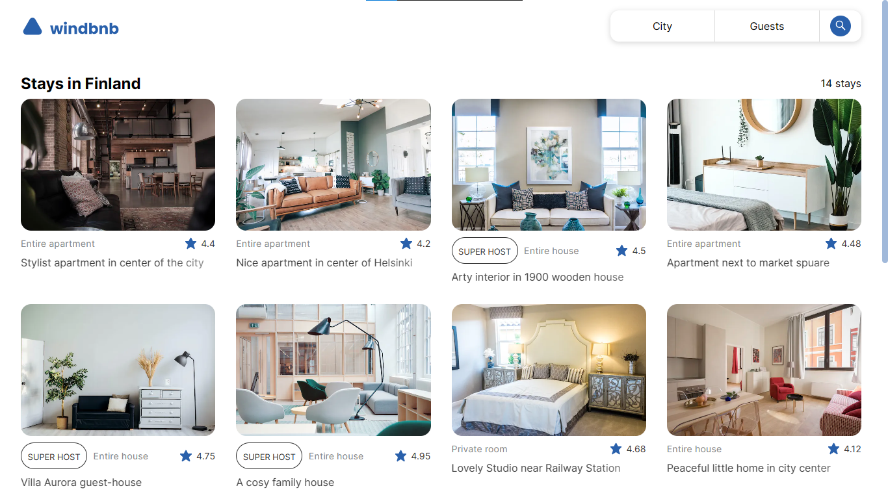

<h1 align="center">Windbnb</h1>

   Solution for a challenge from  <a href="http://devchallenges.io" target="_blank">Devchallenges.io</a>.

  <h3>
    <a href="https://windbnb-flakobb.vercel.app/">
      Demo
    </a>
     | 
    <a href="https://github.com/FlakoBB/windbnb">
      Solution
    </a>
     | 
    <a href="https://devchallenges.io/challenges/3JFYedSOZqAxYuOCNmYD">
      Challenge
    </a>
  </h3>

<!-- TABLE OF CONTENTS -->

## Table of Contents

- [Overview](#overview)
  - [Built With](#built-with)
- [Features](#features)
- [Contact](#contact)

<!-- OVERVIEW -->

## Overview

This challenge pretend to do a Airbnb clone. I did it with **React** using **Next.js**.

My Solution has a search bar that works using a hook **useState** that sends information about what the user request; and then render the corrensponding list.

### Built With

- [React](https://reactjs.org/)
- [Next.js](https://nextjs.org/)

## Features

This application/site was created as a submission to a [DevChallenges](https://devchallenges.io/challenges) challenge. The [challenge](https://devchallenges.io/challenges/3JFYedSOZqAxYuOCNmYD) was to build an application to complete the given user stories.

## Contact

- Redes [Follow me](https://bit.ly/follow-flako)

---